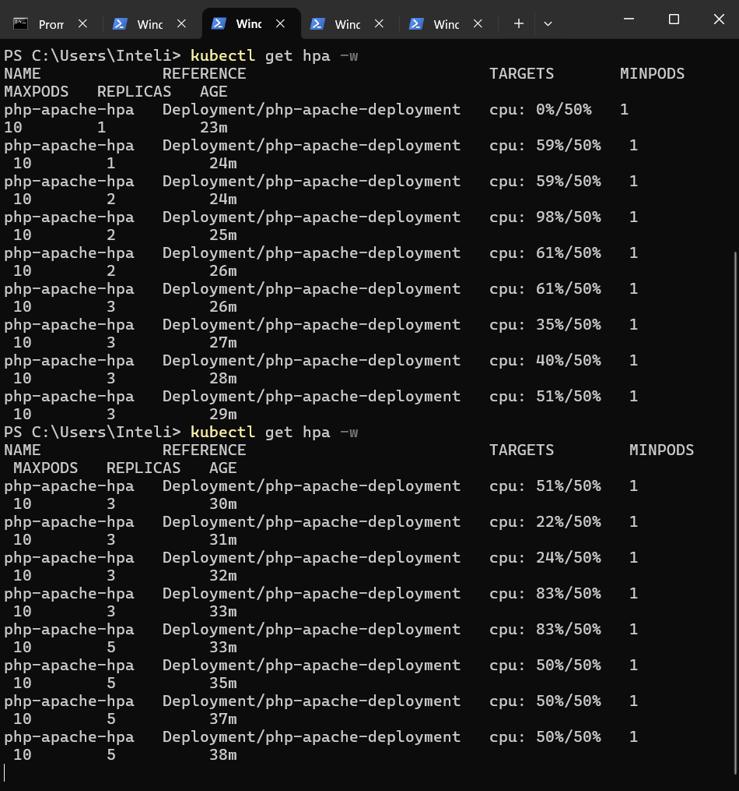
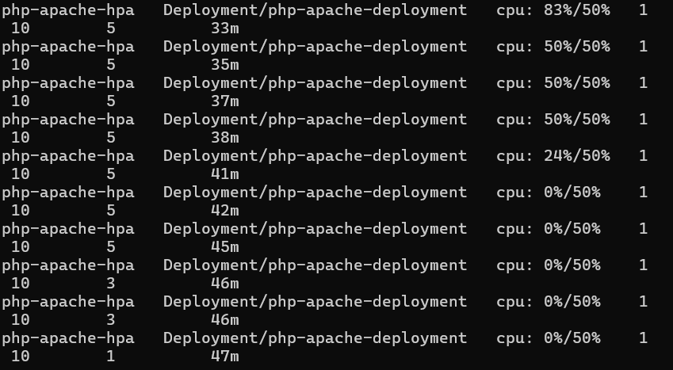

# Ponderada 04: Cluster Kubernetes com Escalabilidade (HPA)

## Objetivo

Este projeto demonstra a configuração de um cluster Kubernetes local utilizando Minikube, com uma aplicação PHP/Apache que escala horizontalmente de forma automática com base no uso de CPU, através do Horizontal Pod Autoscaler (HPA).

## Arquitetura da Solução

* **Cluster Local:** Minikube (rodando com driver Docker no Windows)
* **Aplicação:** Servidor web com PHP e Apache, rodando um script que consome CPU para simular carga.
* **Orquestração:** Kubernetes
* **Escalabilidade:** Horizontal Pod Autoscaler (HPA) configurado para escalar quando o uso médio de CPU ultrapassar 50%.

## Como Executar o Projeto

### Pré-requisitos

* Docker Desktop
* kubectl
* Minikube
* Git

### Passo a Passo

1.  **Clone o repositório:**
    ```bash
    git clone [https://github.com/Gabrielle-Cartaxo/pond_murilove_kubernits](https://github.com/Gabrielle-Cartaxo/pond_murilove_kubernits)
    cd pond_murilove_kubernits
    ```

2.  **Inicie o cluster Minikube e ative o Metrics Server:**
    ```bash
    minikube start --driver=docker
    minikube addons enable metrics-server
    ```

3.  **Construa a imagem Docker e carregue no cluster:**
    ```bash
    # Navegue para a pasta 'app'
    cd app
    docker build -t php-apache-escalavel:v1 .
    cd ..
    minikube image load php-apache-escalavel:v1
    ```

4.  **Aplique os manifestos do Kubernetes:**
    ```bash
    kubectl apply -f k8s/
    ```

5.  **Acesse a aplicação:**
    ```bash
    minikube service php-apache-service
    ```

## Teste de Carga e Análise de Resultados

O teste de carga foi realizado para validar a configuração do HPA.

### 1. Estado Inicial

Antes do teste, o cluster estava em seu estado normal, com 1 réplica (pod) em execução, e o consumo de CPU era mínimo.

#### HPA inicial

<div align= "center">


</div>

#### Número de pods inicial

<div align= "center">


</div>


### 2. Durante o Teste de Carga (Scale Up)

Para gerar carga, foi executado o seguinte comando em um terminal PowerShell, que faz requisições contínuas à aplicação:

```powershell
while ($true) { Invoke-WebRequest -Uri "http://127.0.0.1:49888/?limit=100000" }
```

Imediatamente, o uso de CPU na réplica subiu para mais de 100% do solicitado. O HPA detectou essa mudança e começou a criar novas réplicas para distribuir a carga, escalando até `5` réplicas para manter a média de uso de CPU próxima de 50%.
(Ali no meio deu uma caída na porcentagem de uso da CPU porque acidentalmente parei o comando acima, mas logo rodei ele novamente e pode reparar que subiu de 3 réplicas para 5)

#### HPA Estressado 

<div align= "center">



</div>

#### Pods sendo criados

<div align= "center">


</div>


### 3. Após o Teste de Carga (Scale Down)

Após interromper o script de carga, o uso de CPU em todas as réplicas caiu drasticamente. Depois de um período de observação, o HPA começou a reduzir o número de réplicas, retornando ao estado mínimo de 1, otimizando o uso de recursos.

#### Uso da CPU diminuindo

<div align= "center">



</div>

#### Pods sendo destruídos

<div align= "center">


</div>

### Conclusão da Análise

O teste demonstrou com sucesso a funcionalidade do HPA. A aplicação foi capaz de escalar horizontalmente para lidar com o aumento da demanda e, de forma igualmente importante, escalar para baixo quando a demanda cessou, provando ser uma solução elástica e eficiente.